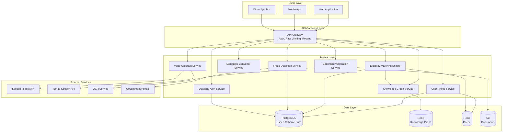

# Design Document: JanSaathi AI

## Overview

JanSaathi AI is a cloud-native, microservices-based platform that leverages AI/ML, knowledge graphs, and multilingual NLP to democratize access to government schemes across India. The system architecture prioritizes scalability (10,000+ concurrent users), multilingual support (22 Indian languages), and high accuracy (95%+ eligibility matching) while maintaining security and data privacy compliance.

The platform consists of eight core microservices: User Profile Service, Eligibility Matching Engine, Knowledge Graph Service, Voice Assistant Service, Language Converter Service, Deadline Alert Service, Fraud Detection Service, and Document Verification Service. These services communicate via REST APIs and message queues, with a centralized API Gateway handling authentication, rate limiting, and routing.

## Architecture

### High-Level Architecture



### Technology Stack

- **Backend Services**: Python (FastAPI) for ML-heavy services, Node.js (Express) for I/O-heavy services
- **Databases**: PostgreSQL (relational data), Neo4j (knowledge graph), Redis (caching)
- **Message Queue**: RabbitMQ for asynchronous processing
- **Storage**: AWS S3 or equivalent for document storage
- **ML/AI**: TensorFlow/PyTorch for custom models, Hugging Face Transformers for NLP
- **Speech Services**: Google Cloud Speech-to-Text/Text-to-Speech or Azure Cognitive Services
- **OCR**: Tesseract OCR with custom training for Indian documents
- **API Gateway**: Kong or AWS API Gateway
- **Deployment**: Kubernetes for container orchestration, Docker for containerization

### Design Principles

1. **Microservices Architecture**: Each service is independently deployable and scalable
2. **API-First Design**: All services expose REST APIs with OpenAPI specifications
3. **Event-Driven Communication**: Asynchronous processing for non-blocking operations
4. **Caching Strategy**: Redis for frequently accessed data (schemes, eligibility rules)
5. **Security by Design**: Encryption at rest and in transit, JWT-based authentication
6. **Multilingual by Default**: All text content stored with language tags, UI supports RTL languages

## Components and Interfaces

### 1. User Profile Service

**Responsibility**: Manage user profiles, validate input data, trigger eligibility recalculation

**API Endpoints**:
- `POST /api/v1/profiles` - Create user profile
- `GET /api/v1/profiles/{userId}` - Retrieve user profile
- `PUT /api/v1/profiles/{userId}` - Update user profile
- `DELETE /api/v1/profiles/{userId}` - Delete user profile

**Interface**:
```python
class UserProfile:
    user_id: str
    age: int  # 0-120
    income: float  # Non-negative
    state: str  # Indian state/UT code
    occupation: str
    category: str  # General, OBC, SC, ST, EWS
    education_level: str
    created_at: datetime
    updated_at: datetime

class ProfileService:
    def create_profile(profile: UserProfile) -> UserProfile
    def get_profile(user_id: str) -> UserProfile
    def update_profile(user_id: str, updates: dict) -> UserProfile
    def delete_profile(user_id: str) -> bool
    def validate_profile(profile: UserProfile) -> ValidationResult
```

**Validation Rules**:
- Age: 0 ≤ age ≤ 120
- Income: income ≥ 0
- State: Must match Indian state/UT codes (ISO 3166-2:IN)
- Required fields: user_id, age, state

### 2. Eligibility Matching Engine

**Responsibility**: Calculate eligibility scores, rank schemes, generate explanations

**API Endpoints**:
- `POST /api/v1/eligibility/match` - Calculate eligibility for user
- `GET /api/v1/eligibility/schemes/{schemeId}/score` - Get score for specific scheme
- `GET /api/v1/eligibility/explain/{schemeId}` - Get eligibility explanation

**Interface**:
```python
class EligibilityScore:
    scheme_id: str
    user_id: str
    score: float  # 0-100
    explanation: str
    matching_criteria: list[str]
    missing_criteria: list[str]
    confidence: float

class EligibilityEngine:
    def calculate_eligibility(user_profile: UserProfile, scheme: Scheme) -> EligibilityScore
    def rank_schemes(user_profile: UserProfile, schemes: list[Scheme]) -> list[EligibilityScore]
    def generate_explanation(score: EligibilityScore, language: str) -> str
    def get_recommended_schemes(user_id: str, threshold: float = 0.7) -> list[EligibilityScore]
```

**Matching Algorithm**:
1. **Rule-Based Matching**: Check hard constraints (age range, income limits, state)
2. **Weighted Scoring**: Assign weights to criteria based on importance
   - Age match: 20%
   - Income match: 25%
   - Category match: 20%
   - Occupation match: 15%
   - Education match: 10%
   - State match: 10%
3. **ML Enhancement**: Use trained model to adjust scores based on historical success rates
4. **Threshold Filtering**: Return schemes with score ≥ 70%

**Explanation Generation**:
- Template-based: "You qualify because you are {age} years old, earn ₹{income}/month, and belong to {category} category"
- Simplification: Use Language Converter Service for 5th-grade reading level

### 3. Knowledge Graph Service

**Responsibility**: Manage scheme relationships, discover connections, detect conflicts

**API Endpoints**:
- `POST /api/v1/knowledge-graph/schemes/{schemeId}/relations` - Add scheme relationships
- `GET /api/v1/knowledge-graph/related/{schemeId}` - Get related schemes
- `GET /api/v1/knowledge-graph/conflicts/{userId}` - Detect application conflicts
- `GET /api/v1/knowledge-graph/discover/{schemeId}` - Discover transitive relationships

**Graph Schema**:
```
Nodes:
- Scheme (id, name, description, state, category)
- Eligibility_Criterion (type, value, operator)
- Document (type, name, validity_period)
- Benefit (type, amount, duration)

Relationships:
- REQUIRES (Scheme → Eligibility_Criterion)
- NEEDS_DOCUMENT (Scheme → Document)
- PROVIDES (Scheme → Benefit)
- RELATED_TO (Scheme → Scheme, weight: float)
- CONFLICTS_WITH (Scheme → Scheme, reason: str)
- PREREQUISITE_FOR (Scheme → Scheme)
```

**Interface**:
```python
class KnowledgeGraphService:
    def add_scheme(scheme: Scheme) -> str
    def add_relationship(from_id: str, to_id: str, rel_type: str, properties: dict) -> bool
    def find_related_schemes(scheme_id: str, max_depth: int = 2) -> list[Scheme]
    def detect_conflicts(user_id: str, scheme_ids: list[str]) -> list[Conflict]
    def discover_transitive_eligibility(scheme_id: str) -> list[Scheme]
    def explain_connection(scheme_a: str, scheme_b: str) -> str
```

**Conflict Detection**:
- Check for mutually exclusive categories (e.g., BPL and APL schemes)
- Identify duplicate benefit types (e.g., two education scholarships)
- Detect prerequisite violations (e.g., applying for advanced scheme without basic)

### 4. Voice Assistant Service

**Responsibility**: Convert speech to text, process voice queries, generate voice responses

**API Endpoints**:
- `POST /api/v1/voice/transcribe` - Convert speech to text
- `POST /api/v1/voice/synthesize` - Convert text to speech
- `POST /api/v1/voice/query` - Process voice query end-to-end

**Interface**:
```python
class VoiceAssistant:
    def transcribe_audio(audio_data: bytes, language: str) -> TranscriptionResult
    def synthesize_speech(text: str, language: str, voice_type: str) -> bytes
    def process_voice_query(audio_data: bytes, user_id: str) -> VoiceResponse
    def detect_language(audio_data: bytes) -> str
    def handle_dialect(audio_data: bytes, base_language: str) -> TranscriptionResult

class TranscriptionResult:
    text: str
    language: str
    confidence: float
    alternatives: list[str]

class VoiceResponse:
    text_response: str
    audio_response: bytes
    language: str
```

**Supported Languages** (ISO 639-1 codes):
- hi (Hindi), ta (Tamil), te (Telugu), bn (Bengali), kn (Kannada)
- ml (Malayalam), mr (Marathi), gu (Gujarati), or (Odia), pa (Punjabi)
- as (Assamese), ur (Urdu), ks (Kashmiri), sd (Sindhi), sa (Sanskrit)
- ne (Nepali), kok (Konkani), mni (Manipuri), doi (Dogri), mai (Maithili)
- sat (Santali), bo (Bodo)

**Dialect Handling**:
- Maintain dialect-to-standard-language mappings
- Use fuzzy matching for regional variations
- Fall back to base language if dialect recognition fails

### 5. Language Converter Service

**Responsibility**: Simplify complex government jargon, maintain accuracy, provide examples

**API Endpoints**:
- `POST /api/v1/language/simplify` - Simplify text to 5th-grade level
- `POST /api/v1/language/explain-term` - Explain technical term with example
- `GET /api/v1/language/glossary` - Get glossary of common terms

**Interface**:
```python
class LanguageConverter:
    def simplify_text(text: str, target_level: int = 5) -> SimplifiedText
    def explain_term(term: str, context: str) -> Explanation
    def get_reading_level(text: str) -> int
    def preserve_accuracy(original: str, simplified: str) -> bool

class SimplifiedText:
    original: str
    simplified: str
    reading_level: int
    preserved_terms: list[str]  # Terms that couldn't be simplified

class Explanation:
    term: str
    simple_definition: str
    example: str
    original_definition: str
```

**Simplification Rules**:
- Replace jargon with everyday words: "beneficiary" → "person who gets benefits"
- Add examples: "BPL category" → "People with income below ₹15,000/month (Below Poverty Line)"
- Break long sentences into shorter ones (max 15 words)
- Use active voice instead of passive
- Replace percentages with fractions: "50%" → "half"

**Accuracy Preservation**:
- Maintain numerical values exactly
- Keep legal terms with explanations
- Preserve eligibility criteria logic
- Flag terms that cannot be simplified without meaning loss

### 6. Deadline Alert Service

**Responsibility**: Predict application windows, send reminders, manage notification preferences

**API Endpoints**:
- `POST /api/v1/deadlines/predict/{schemeId}` - Predict next application window
- `POST /api/v1/deadlines/subscribe` - Subscribe to deadline alerts
- `GET /api/v1/deadlines/calendar/{userId}` - Get user's deadline calendar
- `POST /api/v1/deadlines/notify` - Send deadline notification

**Interface**:
```python
class DeadlinePredictor:
    def predict_window(scheme_id: str, historical_years: int = 3) -> ApplicationWindow
    def get_upcoming_deadlines(user_id: str, days_ahead: int = 90) -> list[Deadline]
    def send_reminder(user_id: str, scheme_id: str, days_before: int) -> bool
    def consolidate_calendar(user_id: str) -> Calendar

class ApplicationWindow:
    scheme_id: str
    predicted_start: date
    predicted_end: date
    confidence: float
    historical_dates: list[date]

class Deadline:
    scheme_id: str
    scheme_name: str
    deadline_date: date
    days_remaining: int
    state: str
```

**Prediction Algorithm**:
1. **Historical Analysis**: Collect application dates from past 3+ years
2. **Pattern Detection**: Identify recurring patterns (e.g., "every April", "2nd Monday of month")
3. **ML Model**: Train time-series model (LSTM or Prophet) on historical data
4. **Confidence Scoring**: Calculate confidence based on pattern consistency
5. **State-Specific Adjustment**: Account for state-level variations

**Notification Strategy**:
- Send alerts at: 30, 15, 7, 2 days before deadline
- Channels: WhatsApp (primary), SMS (fallback), In-app notification
- Batch notifications: Consolidate multiple deadlines in single message
- Respect user preferences: Allow opt-out, frequency control

### 7. Fraud Detection Service

**Responsibility**: Verify scheme authenticity, detect scam patterns, maintain official database

**API Endpoints**:
- `POST /api/v1/fraud/verify-scheme` - Verify scheme against official database
- `POST /api/v1/fraud/check-url` - Verify application URL
- `POST /api/v1/fraud/scan-content` - Scan for scam patterns
- `GET /api/v1/fraud/official-portals` - Get list of verified portals

**Interface**:
```python
class FraudDetector:
    def verify_scheme(scheme_id: str, scheme_name: str) -> VerificationResult
    def check_url(url: str) -> URLVerification
    def scan_for_scams(content: str) -> ScanResult
    def update_official_database() -> bool
    def add_scam_pattern(pattern: ScamPattern) -> bool

class VerificationResult:
    is_verified: bool
    source: str  # Official portal URL
    confidence: float
    warnings: list[str]

class URLVerification:
    is_official: bool
    domain: str
    ssl_valid: bool
    government_domain: bool  # .gov.in, .nic.in

class ScanResult:
    is_suspicious: bool
    matched_patterns: list[str]
    risk_score: float  # 0-100
    recommendations: list[str]
```

**Verification Process**:
1. **Database Cross-Reference**: Check scheme against official government databases
2. **URL Validation**: 
   - Verify domain is .gov.in, .nic.in, or whitelisted domain
   - Check SSL certificate validity
   - Verify HTTPS protocol
3. **Pattern Matching**: Compare against 500+ known scam templates
   - "Pay ₹X to apply" (legitimate schemes are free)
   - "Limited time offer" with urgency tactics
   - "Guaranteed approval" claims
   - Requests for bank account passwords
4. **Risk Scoring**: Aggregate signals into 0-100 risk score

**Official Database Sources**:
- National Portal of India (india.gov.in)
- MyScheme portal (myscheme.gov.in)
- State government portals (all 28 states + 8 UTs)
- Ministry-specific portals (agriculture, education, social welfare, etc.)

**Update Frequency**: Daily sync at 2 AM IST

### 8. Document Verification Service

**Responsibility**: Extract text from documents, verify validity, check expiry dates

**API Endpoints**:
- `POST /api/v1/documents/upload` - Upload document for verification
- `GET /api/v1/documents/{documentId}/status` - Get verification status
- `POST /api/v1/documents/verify` - Verify document authenticity
- `GET /api/v1/documents/requirements/{schemeId}` - Get required documents for scheme

**Interface**:
```python
class DocumentChecker:
    def upload_document(user_id: str, doc_type: str, file: bytes) -> Document
    def extract_text(document_id: str) -> ExtractionResult
    def verify_document(document_id: str) -> VerificationResult
    def check_expiry(document_id: str) -> ExpiryStatus
    def check_completeness(document_id: str, required_fields: list[str]) -> CompletenessResult

class Document:
    document_id: str
    user_id: str
    doc_type: str  # AADHAAR, PAN, INCOME_CERT, CASTE_CERT
    file_path: str
    uploaded_at: datetime
    status: str  # PENDING, VERIFIED, REJECTED

class ExtractionResult:
    document_id: str
    extracted_text: str
    confidence: float
    fields: dict  # Extracted structured data

class VerificationResult:
    is_valid: bool
    doc_type: str
    extracted_fields: dict
    missing_fields: list[str]
    expiry_date: date
    is_expired: bool
    warnings: list[str]
```

**Supported Document Types**:

1. **Aadhaar Card**:
   - Extract: Name, Aadhaar number (12 digits), DOB, Address
   - Verify: Checksum validation, format check
   - No expiry

2. **PAN Card**:
   - Extract: Name, PAN number (10 characters), DOB
   - Verify: Format check (AAAAA9999A)
   - No expiry

3. **Income Certificate**:
   - Extract: Name, Income amount, Issue date, Valid until
   - Verify: Issuing authority stamp, signature
   - Expiry: Typically 6 months or 1 year

4. **Caste Certificate**:
   - Extract: Name, Caste/Category, Issue date, Valid until
   - Verify: Issuing authority stamp, signature
   - Expiry: Varies by state (typically 1-3 years)

**OCR Pipeline**:
1. **Preprocessing**: Deskew, denoise, enhance contrast
2. **Text Extraction**: Tesseract OCR with custom training data for Indian documents
3. **Field Extraction**: Regex patterns + NER model to extract structured fields
4. **Validation**: Check format, checksums, required fields
5. **Authenticity Check**: Verify security features (holograms, watermarks) using image processing

**Accuracy Target**: 90%+ OCR accuracy for printed documents

## Data Models

### User Profile
```python
class UserProfile:
    user_id: str  # UUID
    phone_number: str  # Primary identifier
    age: int
    date_of_birth: date
    income: float  # Monthly income in INR
    state: str  # ISO 3166-2:IN code
    district: str
    occupation: str
    category: str  # GENERAL, OBC, SC, ST, EWS
    education_level: str  # BELOW_10TH, 10TH, 12TH, GRADUATE, POSTGRADUATE
    gender: str  # MALE, FEMALE, OTHER
    preferred_language: str  # ISO 639-1 code
    created_at: datetime
    updated_at: datetime
    is_active: bool
```

### Scheme
```python
class Scheme:
    scheme_id: str  # UUID
    name: str
    name_translations: dict[str, str]  # {language_code: translated_name}
    description: str
    description_translations: dict[str, str]
    state: str  # ALL for central schemes, specific state code for state schemes
    category: str  # EDUCATION, AGRICULTURE, HEALTH, EMPLOYMENT, WOMEN, etc.
    eligibility_criteria: list[EligibilityCriterion]
    required_documents: list[str]
    benefits: list[Benefit]
    application_process: str
    official_url: str
    is_active: bool
    created_at: datetime
    updated_at: datetime
```

### Eligibility Criterion
```python
class EligibilityCriterion:
    criterion_id: str
    scheme_id: str
    field: str  # age, income, state, occupation, category, education
    operator: str  # EQUALS, GREATER_THAN, LESS_THAN, IN_RANGE, IN_LIST
    value: any  # Single value or list/range
    is_mandatory: bool
    weight: float  # For scoring (0-1)
```

### Application Window
```python
class ApplicationWindow:
    window_id: str
    scheme_id: str
    start_date: date
    end_date: date
    year: int
    is_predicted: bool
    confidence: float  # For predicted windows
    created_at: datetime
```

### Document
```python
class Document:
    document_id: str
    user_id: str
    doc_type: str
    file_path: str  # S3 path
    extracted_data: dict
    verification_status: str  # PENDING, VERIFIED, REJECTED
    issue_date: date
    expiry_date: date
    is_expired: bool
    uploaded_at: datetime
    verified_at: datetime
```

### Notification
```python
class Notification:
    notification_id: str
    user_id: str
    scheme_id: str
    type: str  # DEADLINE_REMINDER, ELIGIBILITY_MATCH, DOCUMENT_EXPIRY
    channel: str  # WHATSAPP, SMS, IN_APP
    message: str
    scheduled_at: datetime
    sent_at: datetime
    status: str  # SCHEDULED, SENT, FAILED
```

### Fraud Report
```python
class FraudReport:
    report_id: str
    scheme_name: str
    url: str
    content: str
    risk_score: float
    matched_patterns: list[str]
    is_verified: bool
    reported_at: datetime
    verified_at: datetime
```

## Correctness Properties

*A property is a characteristic or behavior that should hold true across all valid executions of a system—essentially, a formal statement about what the system should do. Properties serve as the bridge between human-readable specifications and machine-verifiable correctness guarantees.*

